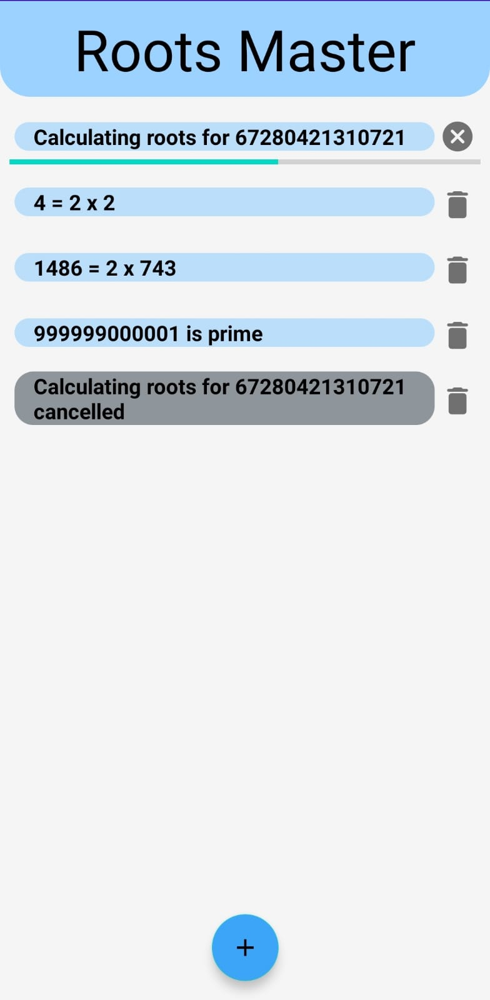

# Roots Master
An android application that calculates roots. 
This app was written as part of PostPc (Android) course of The Hebrew University of Jerusalem.

## Technologies and tools
This app was written in Android Studio using Java. 
Calculations are being done in the background using the WorkManager library.

## Overview
The app has one screen that contains the current and previous calculations. 
During the calculation the user can see the progress, and stop the calculation. 
When the calculation is completed, the result is displayed to the user who can delete the record. 

    

## Ethical pledge
I pledge the highest level of ethical principles in support of academic excellence. I ensure that all of my work reflects my own abilities and not those of someone else.